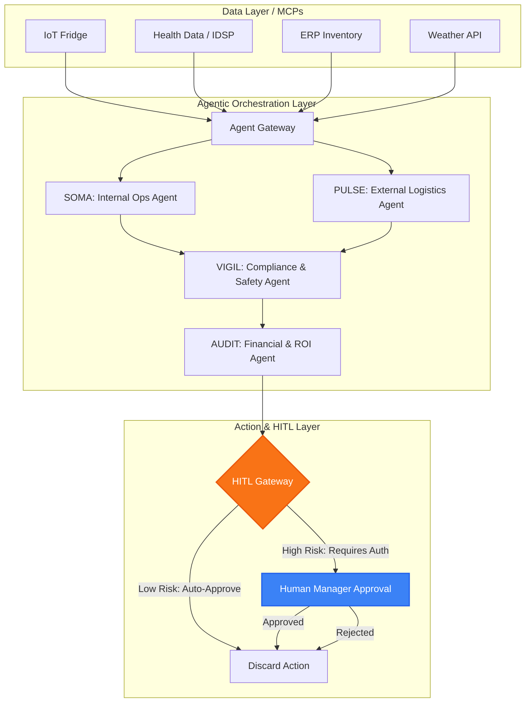
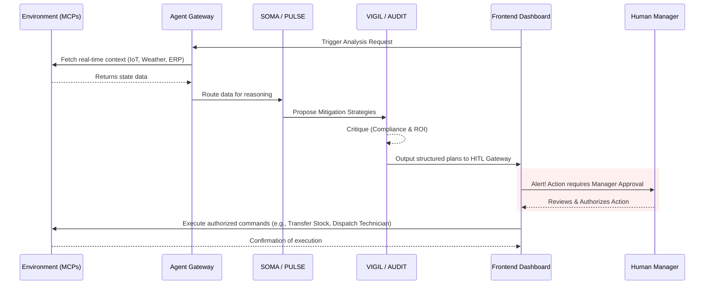

<div align="center">
  <h1>💊 PharmaIQ</h1>
  <p><strong>Autonomous Healthcare Retail Operations Powered by Multi-Agent AI</strong></p>
</div>

---

## 📖 Table of Contents
- [Problem Statement](#-problem-statement)
- [The Solution](#-the-solution)
- [Unique Selling Propositions (USPs)](#-unique-selling-propositions-usps)
- [Architecture](#%EF%B8%8F-architecture)
- [Application Flow](#-application-flow)
- [Technology Stack](#-technology-stack)
- [Getting Started](#-getting-started)
- [Key Features](#-key-features)

---

## 🚨 Problem Statement
Healthcare retail operations, particularly pharmacy chains, face complex, high-stakes challenges:
- **Cold Chain Failures**: Traditional temperature monitoring is reactive. By the time an alert is addressed, critical biologics (like vaccines and insulin) often spoil.
- **Epidemic Blind Spots**: Pharmacies often struggle to dynamically adapt inventory in response to fast-moving localized outbreaks (e.g., Dengue or Flu clusters).
- **Compliance & Safety**: Automated decisions in healthcare must adhere stringently to CDSCO/FDA guidelines. Fully autonomous systems without oversight pose immense safety and legal risks.
- **Fragmented Systems**: HR scheduling, ERP inventory, IoT sensors, and weather data live in siloes, making unified decision-making nearly impossible.

## 💡 The Solution
**PharmaIQ** is an agentic AI platform designed to seamlessly orchestrate complex healthcare retail operations. By uniting a **LangGraph-driven Multi-Agent System** with a robust **Model Context Protocol (MCP) data layer**, PharmaIQ shifts retail pharmacy operations from reactive to autonomously proactive.

It continuously monitors IoT feeds, epidemiological health data, weather patterns, and internal ERP/HRMS systems. The AI agents reason over this data, debate compliance and financial viability, and propose concrete actions—gating high-impact decisions through a secure **Human-in-the-Loop (HITL)** approval gateway.

## ⭐ Unique Selling Propositions (USPs)
- **Multi-Agent Deliberation**: Different AI agents act as domain experts (Operations, Logistics, Compliance, Finance), critiquing each other to arrive at optimal operational strategies.
- **MCP-Native Integration**: Utilizes the Model Context Protocol to seamlessly interface with 8 distinct enterprise and environmental data servers.
- **Human-in-the-Loop (HITL) Safety**: Critical actions (like emergency stock transfers or overriding rosters) are paused pending Manager Approval, bridging the gap between automation and clinical safety.
- **Predictive Cold Chain Protection**: Anticipates spoilage *before* it happens by correlating ambient weather, IoT compressor data, and real-time maintenance logs.

---

## 🏗️ Architecture

PharmaIQ is built around a high-fidelity orchestration pattern using LangGraph and Gemini 2.0 Flash.



### 🧠 The Agents
1. **SOMA (Internal AI)**: Deep dives into internal store data. Monitors fridge temperatures (IoT), pharmacist staffing (HRMS), and drug degradation times.
2. **PULSE (External AI)**: Analyzes external environmental factors. Monitors weather patterns (e.g., incoming Monsoons) and local disease surveillance (IDSP clusters).
3. **VIGIL (Safety AI)**: The compliance officer. Critiques all proposed actions from SOMA and PULSE to ensure strict adherence to CDSCO compliance and patient safety.
4. **AUDIT (Financial AI)**: The bean-counter. Validates the ROI, cost implications, and logistical feasibility of every authorized decision.

---

## 🔄 Application Flow



---

## 💻 Technology Stack

**Backend**
- **Framework**: FastAPI (Python 3.10+)
- **AI / LLM**: Google Gemini 2.0 Flash
- **Orchestration**: LangGraph (for stateful multi-agent pipelines)
- **Tooling**: Model Context Protocol (MCP) for deterministic tool calling

**Frontend**
- **Framework**: Next.js 14+ (React)
- **Language**: TypeScript
- **Styling**: Tailwind CSS with Glassmorphism UI principles
- **Animations**: Framer Motion

---

## 🚀 Getting Started

Follow these steps to run PharmaIQ locally.

### 1. Prerequisites
- Python 3.10+
- Node.js 18+
- Google Gemini API Key

### 2. Backend Setup
Navigate to the `backend` directory, set up your virtual environment, and start the FastAPI server.

```bash
cd backend
python3 -m venv venv
source venv/bin/activate
pip install -r requirements.txt

# Create a .env file and add your clear text API key
echo "GOOGLE_API_KEY=your_gemini_api_key_here" > .env

# Start the uvicorn server
uvicorn main:app --port 8000 --reload
```
*The backend should now be running on `http://localhost:8000`.*

### 3. Frontend Setup
Open a new terminal window, navigate to the `frontend` directory, install dependencies, and start the Next.js development server.

```bash
cd frontend
npm install

# Start the Next.js server (it will use port 3000 or 3001 if 3000 is occupied)
npm run dev
```
*The frontend should now be accessible at `http://localhost:3000` (or 3001).*

### 4. Running the Pipeline
1. Open your browser to `http://localhost:3000` (or `3001`).
2. Click the **"Trigger Analysis"** button on the Dashboard.
3. Watch the terminal logs or UI as the LangGraph agents collect signals, reason through them, and debate compliance (takes ~30-60 seconds).
4. Review the final proposed actions in the **Safety Review** tab and **Authorize** the high-risk operations to close the loop!

---

## 🛡️ Key Features

- **HITL (Human-in-the-Loop) Interactivity**: Retain absolute control over mission-critical decisions via a dedicated Manager Approval interface.
- **Cold Chain Protection**: Predictive alerting combined with automated technician dispatch logic stops spoilage before it happens.
- **Epidemic Preemption (Proactive Logistics)**: Cross-references public health cluster data with internal warehouse stock to preemptively re-route medications to high-demand zones.
- **Premium Glassmorphism UI**: A visually stunning, highly responsive dashboard designed for clarity in high-pressure operational environments.
- **Live Agent State Tracking**: Transparent UI showing the exact reasoning steps and critiques happening inside the LangGraph state machine.
