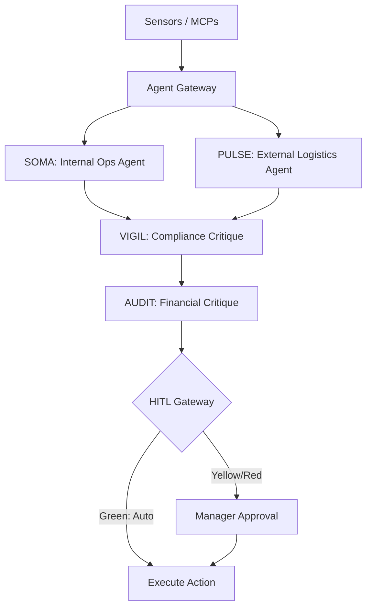

# PharmaIQ: Autonomous Healthcare Retail Operations

PharmaIQ is an agentic AI platform designed to orchestrate complex healthcare retail operations. It combines a Multi-Agent system (LLM-based reasoning) with a Model Context Protocol (MCP) data layer to automate cold chain monitoring, epidemic surveillance, and inventory management.

## 🏗 Architecture & Flow

PharmaIQ uses a high-fidelity agentic orchestration pattern built on **LangGraph** and **Gemini 2.0 Flash**.



### 🧠 The Agents
- **SOMA (Internal AI)**: Monitors fridge temperatures (IoT), pharmacist staffing (HRMS), and drug stability.
- **PULSE (External AI)**: Monitors weather patterns (Monsoon alerts) and disease surveillance (IDSP clusters).
- **VIGIL (Safety AI)**: Critiques all proposed actions for CDSCO compliance and patient safety.
- **AUDIT (Financial AI)**: Validates the ROI and logistical feasibility of every decision.

### 🔌 Model Context Protocol (MCP) Layer
PharmaIQ communicates with its environment through 8 specialized MCP servers:
- **IoT Fridge**: Real-time temperature streams.
- **Health Data**: IDSP disease cluster reports.
- **ERP Inventory**: Multi-warehouse stock levels.
- **Distributor**: Supply chain fulfillment API.
- ...and others for Weather, HRMS, and Sales.

---

## 🚀 Getting Started

### 1. Prerequisites
- Python 3.10+
- Node.js 18+
- Google Gemini API Key

### 2. Backend Setup
```bash
cd backend
python3 -m venv venv
source venv/bin/activate
pip install -r requirements.txt
# Set GOOGLE_API_KEY in .env
uvicorn main:app --port 8001
```

### 3. Frontend Setup
```bash
cd frontend
npm install
npm run dev -- -p 3001
```

### 4. Running the Pipeline
1. Open `http://localhost:3001`
2. Click **"Trigger Analysis"** on the Dashboard.
3. The agents will collect signals, reason through them, and propose actions (takes ~90 seconds).
4. Review and Authorize actions in the **Safety Review** tab.

---

## 🛡️ Key Features
- **HITL (Human-in-the-Loop)**: High-risk decisions are gated by a human approval flow.
- **Cold Chain Protection**: Predictive alerts for fridge failures before medicine spoils.
- **Epidemic Preemption**: Strategic stock transfers based on rising dengue/flu clusters.
- **Glassmorphism UI**: A premium, responsive dashboard built with Next.js and Tailwind CSS.
